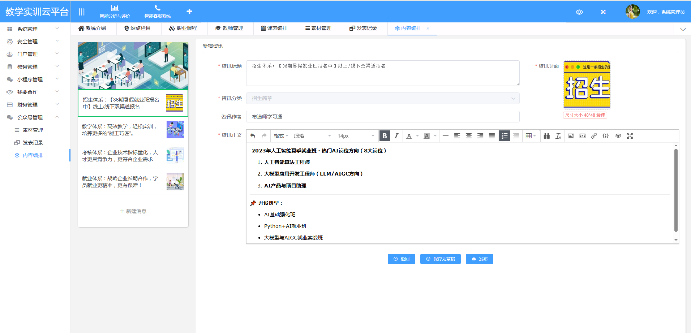
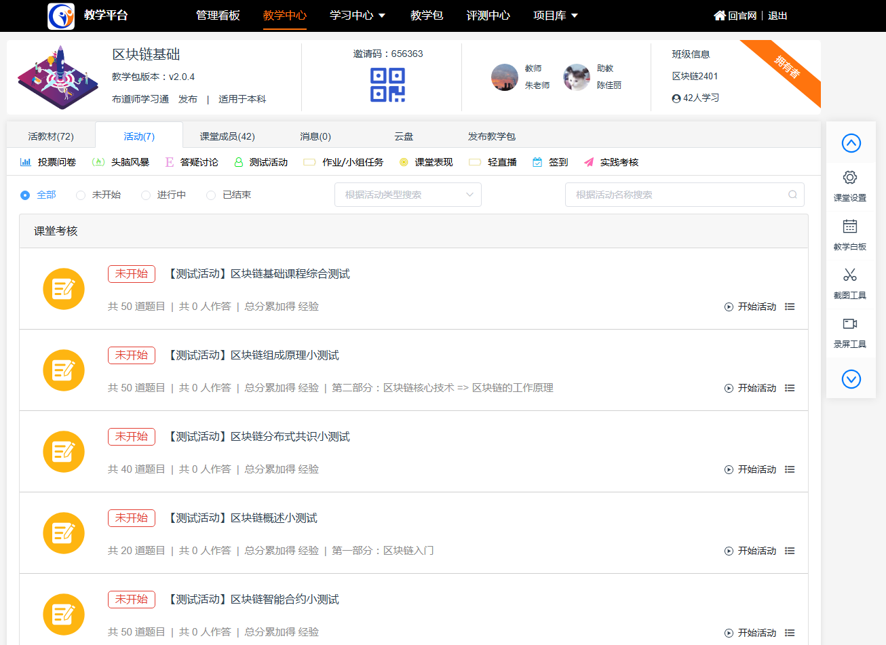

# BudaOS Monolith

<div align="center">

[](LICENSE)
[](https://adoptium.net/)
[](https://spring.io/projects/spring-boot)
[](https://www.mysql.com/)

**BudaOS Monolith** 是一款专为企业内训和中小型教育培训机构打造的在线学习管理平台（LMS）开源解决方案。采用经典三层架构设计，100% 源代码开放，支持快速部署、灵活定制和深度二次开发。

*企业内训首选 | 教培机构利器 | 源码二开无忧*

[](https://www.budaos.com)
[](#支持我们)

</div>

---

## 系统预览

深入了解 BudaOS 学习平台的完整功能与优雅界面：

### 管理后台

*教务管理、用户管理、数据统计*

### 学习门户

*课程学习、作业考试、社区互动*

### 移动端

*随时随地，碎片化学习*

> 💡 更多功能等你探索，立即体验：[在线演示](https://www.budaos.com)

---

## 项目简介

BudaOS Monolith 是一个功能完备、开箱即用的在线学习管理平台（LMS），深度契合企业内训和教培机构的实际业务场景。系统涵盖教学管理、在线课堂、活动互动、社区运营、即时通讯等核心功能模块，帮助企业快速搭建专属的学习培训平台，让知识传递更高效、学习效果更可追踪。

### 适用场景

| 场景 | 核心价值 |
|------|----------|
| **企业内训** | 新员工培训、岗位技能提升、产品知识学习、合规培训，降低培训成本，提升人效 |
| **职业培训** | IT技能培训、职业资格认证、语言学习，支持直播授课、作业批改、在线考试全流程 |
| **K12教培** | 课程管理、班级管理、家校互动、学习数据分析，提升教学质量和运营效率 |
| **知识付费** | 内容付费、会员体系、学习社群，快速实现知识变现 |

### 为什么选择 BudaOS？

- **源码完全开放**：100% Java 源代码，无任何加密限制，真正拥有系统所有权
- **二开成本低**：经典 Spring Boot 架构，技术栈成熟，维护成本低
- **功能即开即用**：覆盖教学全流程，无需从零开发，缩短上线周期 80%+
- **商业授权友好**：Apache 2.0 协议，可自由商用，支持私有化部署

### 核心特性

- **源码全开放**：Java 源代码 100% 开放，无加密、无后门，真正拥有系统自主权
- **极易二开**：经典三层架构 + 详细注释，熟悉 Spring Boot 的开发者即可上手定制
- **功能完备**：课程管理、在线课堂、作业考试、社区互动一站式解决
- **教学互动丰富**：签到、投票、问答、头脑风暴、实时讨论，让课堂活起来
- **多端支持**：教务管理端、学员学习门户、配套小程序（商业版），覆盖全场景
- **安全可靠**：Spring Security + OAuth2 认证体系，企业级安全防护
- **实时通信**：T-io WebSocket 支持实时课堂、即时消息、在线互动
- **部署灵活**：支持单机部署、Docker 部署、云服务器部署，满足不同规模需求

---

## 技术架构

### 技术栈

| 类别 | 技术选型 |
|------|----------|
| 基础框架 | Spring Boot 2.7.18 |
| 持久层 | MyBatis 2.3 + PageHelper 1.4 |
| 数据库 | MySQL 8.0 + Druid 连接池 |
| 缓存 | Redis (Session 存储) |
| 安全 | Spring Security + OAuth2 |
| 实时通信 | T-io WebSocket |
| 消息队列 | RabbitMQ / Redis MQ |
| 任务调度 | Quartz |
| API 文档 | Swagger 3.0 (SpringFox) |
| 微信生态 | weixin-popular SDK |
| 构建工具 | Maven |

### 项目结构

```
budaos-monolith/
├── budaos-parent/              # 父模块，统一定义依赖版本
│   └── pom.xml
├── budaos-common/              # 公共模块
│   └── src/main/java/          # 工具类、配置类、Domain实体
├── budaos-service/             # 服务模块
│   └── src/main/java/          # 业务服务实现、Mapper
├── budaos-web/                 # Web模块
│   └── src/main/java/          # REST控制器
├── budaos-application/         # 应用模块（启动入口）
│   └── src/main/resources/     # 配置文件
├── database/                   # 数据库脚本
│   └── db.sql
└── pom.xml                     # 项目根 POM
```

### 模块说明

| 模块 | 说明 |
|------|------|
| `budaos-parent` | 统一管理依赖版本、插件配置、公共属性 |
| `budaos-common` | 公共代码：工具类、枚举、常量、Domain实体、配置类 |
| `budaos-service` | 业务逻辑层：Service实现、Mapper接口、Mapper XML、定时任务 |
| `budaos-web` | 控制器层：REST API、拦截器、安全配置 |
| `budaos-application` | 应用打包模块，包含主启动类和配置 |

---

## 功能模块

### 教学管理
- **课堂管理**：创建/管理虚拟教室，设置课程表
- **活动管理**：支持签到、头脑风暴、投票问卷、问答讨论、课后作业、在线测试等多种教学活动
- **资源管理**：课程资源上传下载、云盘文件管理
- **成绩管理**：学生评分、作业批改

### 社区互动
- **博客论坛**：文章发布、评论互动、点赞收藏
- **好友系统**：关注好友、学习圈
- **即时通讯**：私信聊天、群组讨论（WebSocket 实时推送）

### 平台管理
- **用户管理**：教师/学生账号管理、第三方登录
- **微信集成**：微信登录、素材管理、消息推送
- **系统配置**：数据字典、站点设置、SEO优化

### 开发支持
- **API 文档**：Swagger UI 自动生成
- **日志管理**：统一日志记录、异常追踪
- **定时任务**：灵活的 Cron 表达式配置

---

## 快速开始

### 环境要求

| 软件 | 版本要求 | 说明 |
|------|----------|------|
| JDK | 1.8+ | 推荐 OpenJDK 11 |
| MySQL | 8.0+ | 支持 5.7+ |
| Redis | 3.0+ | 用于缓存和 Session |
| Maven | 3.0+ | 构建工具 |

### 部署步骤

#### 1. 准备数据库

```bash
# 登录 MySQL
mysql -u root -p

# 创建数据库
CREATE DATABASE budaos DEFAULT CHARACTER SET utf8mb4 COLLATE utf8mb4_unicode_ci;

# 导入数据脚本
USE budaos;
SOURCE database/db.sql;
```

#### 2. 配置 Redis

确保 Redis 服务已启动，默认配置：
- 端口：6379
- 密码：在 `application.yml` 中配置

#### 3. 修改配置文件

编辑 `budaos-application/src/main/resources/application.yml`：

```yaml
spring:
  datasource:
    url: jdbc:mysql://localhost:3306/budaos?useUnicode=true&characterEncoding=utf8&serverTimezone=Asia/Shanghai
    username: your_username
    password: your_password
  
  redis:
    host: your_redis_host
    password: your_redis_password
```

#### 4. 构建项目

```bash
# 进入项目目录
cd budaos-monolith

# Maven 打包（跳过测试）
mvn clean package -DskipTests
```

#### 5. 启动服务

```bash
# Windows 环境
.\start.bat

# Linux/Mac 环境
java -jar budaos-application/target/budaos-monolith.jar --spring.profiles.active=dev
```

#### 6. 访问系统

启动成功后访问：
- 访问地址：http://localhost:9080
- Swagger 文档：http://localhost:9080/swagger-ui/index.html

---

## 默认账号（体验环境搭建中）

| 角色 | 账号 | 密码      |
|------|------|---------|
| 管理员 | admin | 88888888 |

> ⚠️ **注意**：首次使用请及时修改默认密码

---

## 配置说明

### 核心配置项

```yaml
server:
  port: 9080                    # 服务端口

spring:
  datasource:
    url: jdbc:mysql://...        # 数据库连接
  redis:
    host: localhost              # Redis 主机
    port: 6379                   # Redis 端口

com.budaos:
  file-upload-path: /uploads    # 文件上传路径
  is-cors: true                  # 是否允许跨域
  captcha-enabled: true          # 验证码开关
```

### 微信配置

```yaml
# 第三方登录配置
com.budaos:
  wxAppId: your_wx_appid         # 微信 AppID
  wxAppKey: your_wx_appkey       # 微信 AppKey
```

---
## 商业合作

如果您需要更强大的企业级功能，我们提供**原生微服务架构版本**，为您的业务增长提供坚实的技术底座。

### 微服务版本优势

| 对比项 | 开源单体版 | 商业微服务版 |
|--------|-------|-------------|
| 架构模式 | 单体架构  | 微服务架构（10+ 独立服务） |
| 部署方式 | 单机部署  | 集群/K8S 部署 |
| 扩展能力 | 垂直扩展  | 水平扩展，按需扩容 |
| 性能上限 | 千人级并发 | 十万级并发支持 |
| 运维成本 | 较低    | 自动化运维，持续集成 |
| 技术支持 | 社区支持  | 7×24 专业技术支持 |
| 功能更新 | 社区迭代  | 持续功能迭代，优先体验 |
| 数据安全 | 基础防护  | 企业级安全加固 |

### 技术栈对比

| 技术组件        | 开源版 | 微服务版 |
|-------------| ------ | -------- |
| **Java**    | 1.8+ | 21 (LTS，支持到2031年) |
| **基础框架**    | Spring Boot 2.7 | Spring Boot 3.5.10 |
| **微服务框架**   | — | Spring Cloud 2025.0.1 |
| **微服务生态**   | — | Spring Cloud Alibaba 2025.0.0.0 |
| **服务注册/配置** | — | Nacos 2.4.3 |
| **链路追踪**    | — | Micrometer Tracing 
| **持久层**     | MyBatis 2.3 | MyBatis Plus 3.5.7 |
| **数据库**     | MySQL 8.0 | MySQL 8.0 / PostgreSQL |
| **缓存**      | Redis | Redisson 3.50.0 |
| **消息队列**    | RabbitMQ | Kafka 3.0.0 | 
| **安全框架**    | Spring Security | Sa-Token 1.44.0 (轻量级) |
| **熔断降级**    | — | Sentinel 1.8.8 |
| **分布式事务**   | — | Seata 2.0.0 |
| **连接池**     | Druid 1.2.25 | Druid 1.2.25 |
| **API 文档**  | Swagger 3.0 | Knife4j 4.5.0 |
| **工具库**     | Hutool | Hutool 5.8.39 |

> 💡 **微服务版采用 2024-2025 最新技术栈，性能更强、特性更多、生命周期更长**

### 商业版核心能力

- **弹性伸缩**：基于容器化部署，支持自动扩缩容，轻松应对流量高峰
- **高可用架构**：多副本部署、熔断降级、故障自动恢复，保障业务连续性
- **DevOps 流水线**：自动化构建、测试、部署，提升研发效率
- **全链路监控**：APM 链路追踪、日志聚合、告警通知
- **数据中台**：统一数据治理，BI 分析报表，用户行为洞察
- **私有化部署**：支持完全私有化，数据自主可控
- **定制开发**：根据业务需求深度定制，快速交付

### AI 智能教育（核心亮点）

微服务版本深度集成 **AI 大模型**能力，赋能教育全场景：

| AI 功能 | 说明 |
|---------|------|
| **智能出题** | 根据知识点自动生成选择题、填空题、简答题，支持难度分级 |
| **AI 阅卷** | 客观题自动批改，主观题 AI 辅助评分，准确率高达 95%+ |
| **智能辅导** | 24小时 AI 问答助手，个性化学习路径推荐，因材施教 |
| **教材生成** | 一键生成教学大纲、教案、课件，解放教师双手 |
| **学情分析** | AI 分析学习数据，生成学生画像，预警学习困难 |
| **智能排课** | 基于 AI 算法优化排课方案，提升教室资源利用率 |
| **内容审核** | 自动审核违规内容，营造健康学习环境 |
| **多模态支持** | 支持图文、音频、视频等多种格式的 AI 问答 |

> 🚀 **AI 加持，让教育更智能、更高效、更公平**

### 服务内容

- 源码授权（永久使用）
- 架构设计咨询
- 部署实施指导
- 技术培训服务
- 持续版本升级
- 专属技术支持

> 📞 **有意向？请联系我们获取详细的解决方案和报价**
> 
> 官网：www.budaos.com | 邮箱：contact@budaos.com 
>
> <div align="left">
>   
> </div>

---

## 支持我们

开源不易，如果这个项目对您有帮助，欢迎通过以下方式支持我们：

### 捐赠方式

| 方式 | 说明 |
|------|------|
| ☕ 喝杯咖啡 | 一杯咖啡，一份鼓励 |
| 💝 任意打赏 | 量力而行，感恩有你 |
</br>
> 捐赠时请备注「BudaOS 开源支持」，您的名字将出现在[致谢名单](SUPPORTERS.md)中（可选）。

### 感谢每一份支持

您的每一份捐赠都是对我们最大的鼓励，让我们能够持续维护和迭代开源项目，为社区提供更好的教育资源平台。

---

## 开源协议

本项目采用 [Apache License 2.0](LICENSE) 开源协议。

- ✅ 可免费用于个人学习、企业内部培训
- ✅ 可用于商业项目，打造自有品牌的教育平台
- ✅ 支持深度二次开发，定制专属功能
- ✅ 支持私有化部署，数据完全自主可控
- ⚠️ 需要保留版权声明和 LICENSE 文件

---

## 参与贡献

欢迎提交 Issue 和 Pull Request！

1. Fork 本仓库
2. 创建分支 (`git checkout -b feature/AmazingFeature`)
3. 提交更改 (`git commit -m 'Add AmazingFeature'`)
4. 推送分支 (`git push origin feature/AmazingFeature`)
5. 创建 Pull Request

---

## 联系方式

- **官网**：https://www.budaos.com
- **邮箱**：contact@budaos.com

---

<div align="center">

**如果这个项目对您有帮助，欢迎 Star！**

</div>
